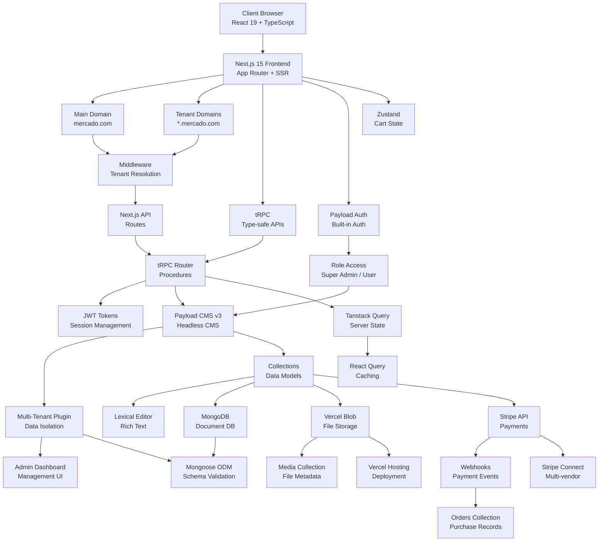
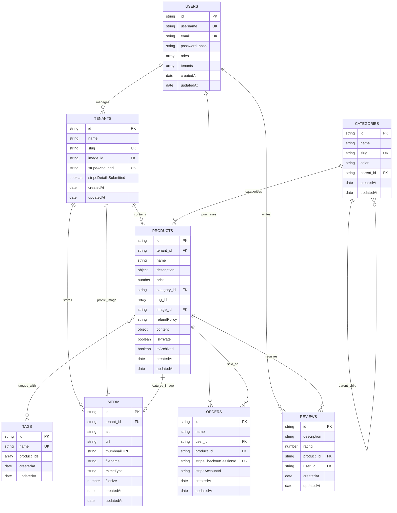

# Mercado - Multi-Tenant Digital Marketplace

[](https://nextjs.org/)
[](https://reactjs.org/)
[](https://www.typescriptlang.org/)
[](https://payloadcms.com/)
[](https://www.mongodb.com/)
[](https://trpc.io/)

A modern, multi-tenant digital marketplace platform where vendors can create custom storefronts and sell digital products. Built with Next.js 15, Payload CMS, and modern web technologies.

## 🏗️ Architecture Overview



## 🗄️ Database Schema



## 🛠️ Tech Stack

### Frontend
- **Next.js 15** - React framework with App Router
- **React 19** - Latest React with concurrent features
- **TypeScript** - Type-safe development
- **TailwindCSS v4** - Utility-first CSS framework
- **shadcn/ui** - Modern UI component library
- **Space Grotesk** - Typography

### Backend & CMS
- **Payload CMS v3** - Headless content management
- **tRPC** - End-to-end type-safe APIs
- **MongoDB** - Document database
- **Mongoose** - MongoDB object modeling

### State Management
- **Zustand** - Lightweight state management (cart)
- **Tanstack Query** - Server state management
- **React Query** - Data fetching and caching

### Authentication & Security
- **Payload Auth** - Built-in authentication system
- **JWT Tokens** - Secure session management
- **Role-based Access** - Multi-level permissions

### Payments & Storage
- **Stripe API** - Payment processing (test mode)
- **Vercel Blob** - File storage and CDN
- **Multi-tenant Plugin** - Data isolation

### Development & Deployment
- **Bun** - Fast package manager and runtime
- **Vercel** - Hosting and deployment
- **ESLint** - Code linting
- **React Hook Form** - Form handling
- **Zod** - Schema validation

## 🚀 Quick Start

### Prerequisites
- Node.js 18+ or Bun
- MongoDB database
- Vercel account (for blob storage)

### Installation

1. **Clone the repository**
```bash
git clone https://github.com/Bhavesh2k4/MultiTenant-DigitalStoreFront
```

2. **Install dependencies**
```bash
bun install
```

3. **Environment setup**
Create `.env.local`:
```env
# Database
DATABASE_URI="mongodb://localhost:27017/mercado"

# Payload CMS
PAYLOAD_SECRET="your-secret-key-here"

# Stripe (Test Mode)
STRIPE_SECRET_KEY="sk_test_..."
STRIPE_WEBHOOK_SECRET="whsec_..."

# File Storage
BLOB_READ_WRITE_TOKEN="vercel_blob_token"

# Domain Configuration
NEXT_PUBLIC_APP_URL="http://localhost:3000"
NEXT_PUBLIC_ROOT_DOMAIN="localhost:3000"
NEXT_PUBLIC_ENABLE_SUBDOMAIN_ROUTING="false"
```

4. **Database setup**
```bash
# Reset and migrate database
bun run db:fresh

# Seed with initial data
bun run db:seed
```

5. **Start development server**
```bash
bun run dev
```

### Access Points
- **Main Marketplace**: `http://localhost:3000`
- **Admin Dashboard**: `http://localhost:3000/admin`
  - Email: `admin@mercado.com`
  - Password: `mercado`

## 📁 Project Structure

```
src/
├── app/                          # Next.js App Router
│   ├── (app)/                   # Main application routes
│   │   ├── (auth)/              # Authentication pages
│   │   ├── (home)/              # Public marketplace
│   │   ├── (library)/           # User library
│   │   ├── (tenants)/           # Tenant storefronts
│   │   └── api/                 # API routes
│   └── (payload)/               # Payload CMS admin
├── collections/                  # Payload collections
│   ├── Users.ts
│   ├── Tenants.ts
│   ├── Products.ts
│   ├── Categories.ts
│   ├── Orders.ts
│   ├── Reviews.ts
│   ├── Tags.ts
│   └── Media.ts
├── modules/                      # Feature modules
│   ├── auth/                    # Authentication
│   ├── checkout/                # Shopping cart
│   ├── products/                # Product management
│   ├── library/                 # User purchases
│   ├── reviews/                 # Review system
│   └── tenants/                 # Multi-tenancy
├── components/                   # Reusable UI components
├── lib/                         # Utilities
└── trpc/                        # tRPC configuration
```

## 🎯 Key Features

### Multi-Tenancy
- **Data Isolation**: Tenant-specific product and media filtering
- **Branded Storefronts**: Customizable vendor experiences

### E-commerce
- **Digital Products**: Upload and sell digital goods
- **Shopping Cart**: Persistent cart with Zustand
- **Payment Processing**: Stripe integration (test mode)
- **Order Management**: Complete purchase lifecycle
- **Review System**: Customer ratings and feedback

### Content Management
- **Rich Text Editor**: Lexical editor for product descriptions
- **Media Management**: Image uploads via Vercel Blob
- **Category System**: Hierarchical product categorization
- **Tag System**: Product tagging and filtering

### User Experience
- **Responsive Design**: Mobile-first approach
- **Search & Filters**: Advanced product discovery
- **User Library**: Purchase history and access
- **Admin Dashboard**: Complete CMS interface

## Testing Payments

**Test Card Details:**
- **Card Number**: `4000 0035 6000 0008`
- **Expiry**: Any future date (e.g., 12/28)
- **CVV**: Any 3 digits (e.g., 567)
- **Name**: Any name

## 📝 Available Scripts

```bash
# Development
bun run dev          # Start development server
bun run build        # Build for production
bun run start        # Start production server

# Database
bun run db:fresh     # Reset and migrate database
bun run db:seed      # Seed initial data

# Code Quality
bun run lint         # Run ESLint
bun run generate:types # Generate Payload types
```

## 🔑 Multi-Tenant Implementation

### Database Isolation
```javascript
// Products filtered by tenant
const products = await payload.find({
  collection: 'products',
  where: {
    tenant: { equals: tenantId },
    isArchived: { not_equals: true }
  }
});

// Media scoped to tenant
const media = await payload.find({
  collection: 'media',
  where: {
    tenant: { equals: tenantId }
  }
});
```

### Access Control
- **Super Admin**: Full system access
- **Tenant Users**: Access to their tenant's data only
- **Public Users**: Read access to non-private products

## 🚧 Known Limitations

1. **Stripe Connect**: Not fully implemented due to Indian payment regulations
2. **Subdomain Routing**: Disabled in development mode
3. **Email Notifications**: Not implemented
4. **Real-time Features**: No WebSocket integration

## 🔮 Future Enhancements

- [ ] Complete Stripe Connect integration
- [ ] Email notification system
- [ ] Advanced analytics dashboard
- [ ] Multi-language support
- [ ] Advanced SEO optimization
- [ ] Subscription products support

## 🤝 Contributing

1. Fork the repository
2. Create a feature branch (`git checkout -b feature/amazing-feature`)
3. Commit your changes (`git commit -m 'Add amazing feature'`)
4. Push to the branch (`git push origin feature/amazing-feature`)
5. Open a Pull Request

## 📄 License

This project is licensed under the MIT License - see the [LICENSE](LICENSE) file for details.

## 🆘 Support

For support, email bhavesh.oct2k4@gmail.com or join our Discord community.
